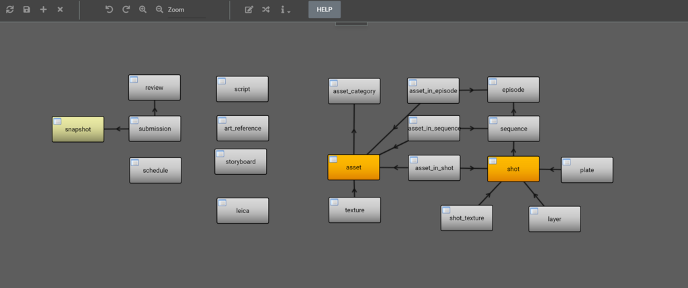

<p align="center">
  
</p>

<p align="center">
  
</p>


## Workflow Platform

TACTIC is an open-source remote collaboration platform used for configuring and deploying enterprise Workflow solutions. 
These solutions simplify the development and delivery of digital assets through a well defined set of processes. 
This is accomplished by integrating a core Workflow Engine with Digital Asset Management and Content Management components to provide a complete platform for individualized enterprise Workflow solutions


## Features

TACTIC has a number of key components:

* **Workflow Engine and Manager:**

<p align="center">
  
</p>

* **Data Management**

<p align="center">
  
</p>

* **Digital Asset Manager**

<p align="center">
  
</p>

* **Web Framework**

<p align="center">
  
</p>


## Contribute

We are always encouraging people to contribute to the project.  This can be in any form starting from asking a question, requesting a feature to fixing bugs or adding new features.  We always welcome feedback as that is the driving force that gives us direction on where to go.  If you do make any changes to the code, please use your own fork and submit a pull request.


## Installation

You can download the latest distributions from any of number of formats from the [community downloads](http://community.southpawtech.com/community/link/downloads) 

or you can access [earlier versions](http://community.southpawtech.com/downloads)

For detailed installation instructions, the [TACTIC System Administration](http://community.southpawtech.com/docs/sys-admin/) documentation is useful


## Getting Started

Getting started is easy.  You can start up quickly with an official VM distribution which has the database and webserver all setup for you.  Refer to the [Quick Start Guide](http://community.southpawtech.com/docs/quick-start/) for more information:


## Documentation

Detailed [documentation](http://community.southpawtech.com/community/link/docs/) can be found on the community site.

There documentation is split in different sections that focus on different aspects of TACTIC:

1. [Quick Start](http://community.southpawtech.com/docs/quick-start/): quick overview of how what to do to get up and running
1. [System Administration](http://community.southpawtech.com/docs/sys-admin/): detailed description of installation and connections to database and other external services.
1. [Setup](http://community.southpawtech.com/docs/setup/): description of how to set up a TACTIC project for end users to work on.
1. [Developer](http://community.southpawtech.com/docs/developer/): documention for developers to customize TACTIC and access the API.


## API

TACTIC has a very deep and mature API allow you to customize almost any part of the system.

Python Example
```python
from tactic_client_lib import TacticServerStub.get()
server = TacticServerStub.get()
shots = server.query("vfx/shot", ['sequence_code', 'SEQ001'])
for shot in shots:
    print("shot: ", shot.get("status") )
```

Javascript Example
```javascript
let server = TACTIC.get();
server.update(shot_key, {'status', 'Complete'})
```

Complete documentation can be found on the [TACTIC Developer Documentation](http://community.southpawtech.com/docs/developer)

## Resources

For more information, visit the [community site](http://community.southpawtech.com) for TACTIC.

Or participate in the [TACTIC forum](http://forum.southpawtech.com) if you have any questions.

There is also a collection of [YouTube videos](https://www.youtube.com/playlist?list=PLGuW4vwnoult0iXF83Y2HnkLbrTJ-3pxO) that you can browser through.


## Visual Effects (VFX)

TACTIC has a built-in VFX module that has been used as a template for countless productions around the world.  Over the years, it's popularity has grown considerably and more and more people become familiar with TACTIC features.  Because TACTIC is Open Source, it can configured and connected seamleassly into any studio producing content.


<p align="center">
  
</p>

Easily start up your production by creating a project with TACTIC nad selecting the VFX template.  Create your own template and reuse your own template for all future productions.

## License

[Eclipse Public License 1.0](LICENSE)
